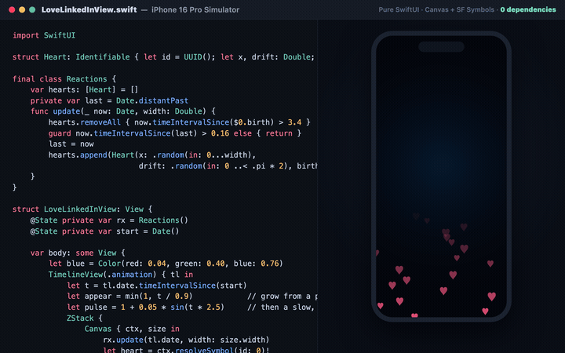
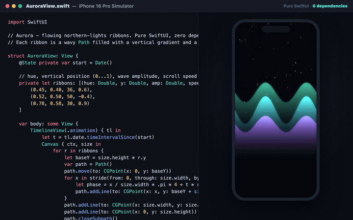
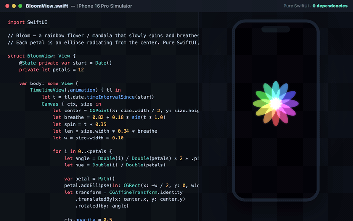
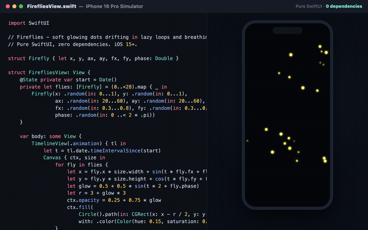
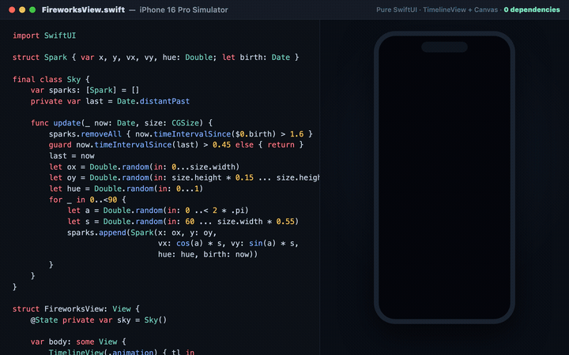

# SwiftUI Animations

Fun, eye-catching SwiftUI animations - each one is a **single file, zero dependencies**. Drop it into your project and hit Run. iOS 15+.

Built for delight (and for sharing). New ones added regularly.

---

## Animations

### I love LinkedIn

A title that grows from a point and gently pulses, floating heart reactions, and fireworks - all in one `Canvas`. `TimelineView` + `Canvas` + SF Symbols.

➡️ [LoveLinkedInView.swift](LoveLinkedInView.swift)

### Aurora

Flowing northern-lights ribbons. Each ribbon is a wavy `Path` filled with a vertical gradient and a soft blur, scrolling at its own speed.

➡️ [AuroraView.swift](AuroraView.swift)

### Bloom

A rainbow flower / mandala that slowly spins and breathes. Each petal is an ellipse radiating from a glowing core - twelve hues, one `Canvas`.

➡️ [BloomView.swift](BloomView.swift)

### Fireflies

Soft glowing dots drifting in lazy loops and breathing in brightness. A calm, warm particle field in a few lines.

➡️ [FirefliesView.swift](FirefliesView.swift)

### Fireworks

A full particle system in ~40 lines: `TimelineView(.animation)` redraws every frame, `Canvas` draws each spark, gravity is one line.

➡️ [FireworksView.swift](FireworksView.swift)

---

## How to use

1. Copy the `.swift` file into your Xcode project.
2. Use the view, e.g. `AuroraView()`.
3. Tweak the constants - colors, speed, counts, amplitude.

Each file is standalone and runs in the Xcode preview.

---

## Credits

Inspired by the SwiftUI animation community - especially Paul Hudson and Amos Gyamfi, whose open work got me experimenting with `Canvas` and `TimelineView`. All code here is my own.

## License

[MIT](LICENSE).
